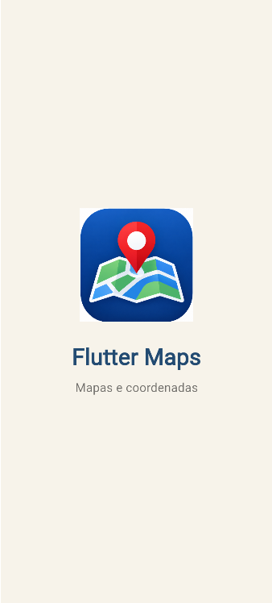
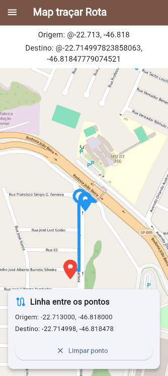
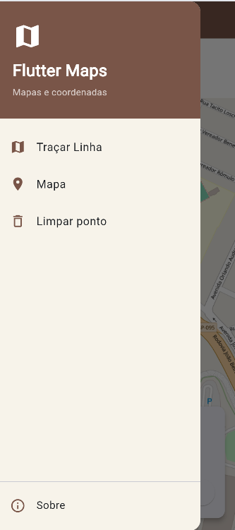

# Flutter Maps - Traçar Rota

Aplicativo desenvolvido em Flutter para a atividade de Mapas da Aula 05 do curso de Desenvolvimento de Sistemas.

O aplicativo utiliza o **OpenStreetMap** para exibir o mapa e o **OSRM (Open Source Routing Machine)** para calcular uma rota entre um ponto de origem e um destino selecionado pelo usuário.

---

## Sobre o projeto

O objetivo do projeto é trabalhar com mapas no Flutter, permitindo que o usuário interaja com o mapa e visualize uma rota entre dois pontos.

O aplicativo permite:

- Visualizar um mapa;
- Selecionar um ponto no mapa;
- Visualizar as coordenadas do destino;
- Definir um ponto de origem e um destino;
- Calcular uma rota seguindo as ruas;
- Visualizar a rota no mapa;
- Limpar o destino selecionado;
- Acessar as opções pelo menu lateral.

---

## Tecnologias utilizadas

- **Flutter**
- **Dart**
- **flutter_map**
- **latlong2**
- **HTTP**
- **OpenStreetMap**
- **OSRM**

---

## Funcionalidades

### Mapa

O aplicativo apresenta um mapa utilizando o OpenStreetMap.


---

### Seleção de destino

Ao tocar em um ponto do mapa, o aplicativo identifica a latitude e a longitude do local selecionado.

O ponto selecionado é marcado no mapa e suas coordenadas são apresentadas na tela.

---

### Traçar rota

Depois que o destino é selecionado, o aplicativo utiliza o **OSRM** para calcular uma rota entre a origem e o destino.

A rota acompanha as ruas do mapa, em vez de simplesmente ligar os dois pontos com uma linha reta.


---

### Coordenadas

O aplicativo apresenta as coordenadas da origem e do destino selecionado.

Exemplo:

```text
Origem: -22.713000, -46.818000
Destino: -22.710110, -46.817516
```

---

### Marcadores

O mapa apresenta marcadores para identificar os pontos utilizados na rota:

- **Azul:** ponto de origem;
- **Vermelho:** ponto de destino.

---

### Menu lateral

O aplicativo possui um menu lateral com opções para facilitar a utilização das funcionalidades disponíveis.


---

## Telas do aplicativo

### Tela inicial

Tela principal do aplicativo, contendo o mapa e o ponto de origem.



### Rota traçada

Tela mostrando o destino selecionado e a rota calculada pelo aplicativo seguindo as ruas.



### Menu lateral

Tela apresentando o menu lateral do aplicativo.



---

## Como executar o projeto

### 1. Clonar o repositório

```bash
git clone URL_DO_SEU_REPOSITORIO
```

### 2. Entrar na pasta do projeto

```bash
cd flutter_maps_nativo
```

### 3. Instalar as dependências

```bash
flutter pub get
```

### 4. Executar o aplicativo

Para executar no navegador:

```bash
flutter run -d chrome
```

Também é possível executar o projeto utilizando um emulador ou dispositivo conectado.

---

## Dependências

As principais dependências utilizadas no projeto são:

```yaml
dependencies:
  flutter:
    sdk: flutter

  flutter_map: ^8.2.2
  latlong2: ^0.9.1
  http: ^1.0.0
```

---

## Como funciona a rota

O aplicativo utiliza o **OSRM (Open Source Routing Machine)** para calcular o trajeto entre a origem e o destino.

Quando o usuário seleciona um destino:

1. O aplicativo identifica a latitude e a longitude do destino;
2. A origem e o destino são enviados para o OSRM;
3. O OSRM calcula o trajeto pelas ruas;
4. O aplicativo recebe os pontos que formam a rota;
5. Os pontos recebidos são utilizados para desenhar a linha no mapa.

Dessa forma, a rota acompanha o caminho das ruas disponíveis no mapa.

---

## Estrutura do projeto

```text
flutter_maps_nativo/
│
├── android/
├── ios/
│
├── lib/
│   ├── main.dart
│   │
│   ├── screens/
│   │   ├── splash_screen.dart
│   │   └── mapa_screen.dart
│   │
│   └── widgets/
│       ├── menu_lateral.dart
│       └── coordenadas_card.dart
│
├── assets/
│   ├── app-release.apk
│   │
│   ├── icons/
│   │   └── app_icon.png
│   │
│   └── screenshots/
│       ├── inicio.png
│       ├── rota.png
│       └── menu.png
│
├── test/
├── pubspec.yaml
├── pubspec.lock
└── README.md
```

---

## APK

O APK do aplicativo está disponível na pasta:

```text
assets/app-release.apk
```

Para gerar o APK novamente, utilize o comando:

```bash
flutter build apk --release
```

Após a geração, o arquivo estará em:

```text
build/app/outputs/flutter-apk/app-release.apk
```

O arquivo pode ser copiado para:

```text
assets/app-release.apk
```

---

## Ícone do aplicativo

O projeto possui um ícone personalizado localizado em:

```text
assets/icons/app_icon.png
```

O ícone é utilizado na identificação do aplicativo e na tela inicial.

---

## Imagens do projeto

As capturas de tela utilizadas neste README estão armazenadas em:

```text
assets/screenshots/
```

Arquivos:

```text
inicio.png
rota.png
menu.png
```

---

## Projeto desenvolvido para

**Curso:** Desenvolvimento de Sistemas  
**Atividade:** Aula 05 - Mapas  
**Tecnologia:** Flutter

---

## Autora

**Clara Andrzejewsky Antonacci**

Projeto desenvolvido como atividade acadêmica do curso de Desenvolvimento de Sistemas.
